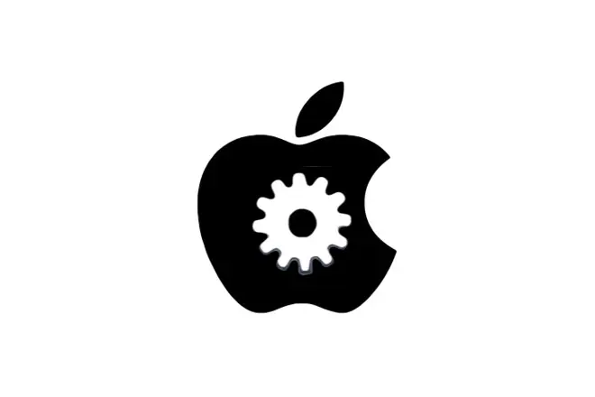

## AppleScript:

#### [介绍](https://baike.baidu.com/item/AppleScript/10572476?fr=aladdin)：
```
AppleScript是苹果公司开发的一种脚本语言，可以用来控制运行于Mac OS上的程序，也可以写成独立运行的Applet。最早版本在1993年十月推出，在System 7（System 7.1.1）运行。
```

##### Mac脚本库，只为mac服务，如果你不是mac系统，一般使用Mac系统中的自动操作app或者快捷指令app编写完成！！！


#### 其他文档资源链接:[自动操作app官方教程](https://support.apple.com/zh-cn/guide/automator/aut4bb6b2b4f/mac);

<hr>

###### 图片展示，可能出现问题，请设置自己github的dns,或者使用 https://gitee.com/LaBiXiaoChen7/GitHub520 来完成设置
###### 相关细节，使用git clone下载项目进行查看，**谢谢**