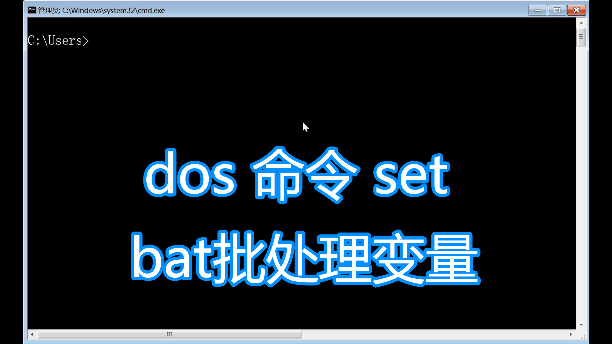

## Bat批处理脚本(废弃):

#### 因为bat脚本的语法繁杂且不易维护，从2021年6月19日开始，不再使用bat语法编写windows执行脚本，如果需要想要windows脚本，请点击[powershe脚本库](../PowerShell脚本/)进行下载

<hr>

<div align="center">

</div>

#### [你应该选择 Powershell 的10个理由(抛弃 cmd)](https://www.jb51.net/article/125100.htm)

<hr>

#### [介绍](https://baike.baidu.com/item/bat/365230?fr=aladdin):
```
批处理文件，在DOS和Windows（任意）系统中，.bat文件是可执行文件，由一系列命令构成，其中可以包含对其他程序的调用。这个文件的每一行都是一条DOS命令（大部分时候就好像我们在DOS提示符下执行的命令行一样），你可以使用DOS下的Edit或者Windows的记事本(notepad)等任何文本文件编辑工具创建和修改批处理文件。
批处理(Batch)，也称为批处理脚本。顾名思义，批处理就是对某对象进行批量的处理，通常被认为是一种简化的脚本语言，它应用于DOS和Windows系统中。批处理文件的扩展名为bat 或cmd。目前比较常见的批处理包含两类：DOS批处理和PS批处理。PS批处理是基于强大的图片编辑软件Photoshop的，用来批量处理图片的脚本；而DOS批处理则是基于DOS命令的，用来自动地批量地执行DOS命令以实现特定操作的脚本。更复杂的情况，需要使用if、for、goto等命令控制程式的运行过程，如同C、Basic等高级语言一样。如果需要实现更复杂的应用，利用外部程式是必要的，这包括系统本身提供的外部命令和第三方提供的工具或者软件。批处理程序虽然是在命令行环境中运行，但不仅仅能使用命令行软件，任何当前系统下可运行的程序都可以放在批处理文件中运行。
```


#### 其他文档资源链接:[Bat批处理脚本学习教程](http://docs.30c.org/dosbat/index.html);

<hr>

###### 图片展示，可能出现问题，请设置自己github的dns,或者使用 https://gitee.com/LaBiXiaoChen7/GitHub520 来完成设置
###### 相关细节，使用git clone下载项目进行查看，**谢谢**