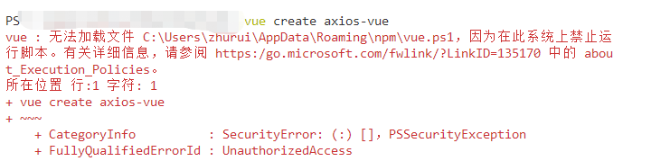

## 脚本名称:取消powershell禁止运行脚本的脚本
#### 功能描述:实现运行脚本自动解决VueCLI在运行命令时，powershell显示禁止脚本运行的情况

#### 处理情况：当你使用vueCLI进行创建项目的过程中，出现一些windows的powershell禁止运行脚本的情况,那你就下载并且使用这个脚本吧




<hr>

#### 脚本执行:

```
1.下载到本地windows系统中，直接点击即可，代码内置了管路员身份运行
2.enjoy it!
```

<hr>

###### 图片展示，可能出现问题，请设置自己github的dns,或者使用 https://gitee.com/LaBiXiaoChen7/GitHub520 来完成设置
###### 相关细节，使用git clone下载项目进行查看，**谢谢**